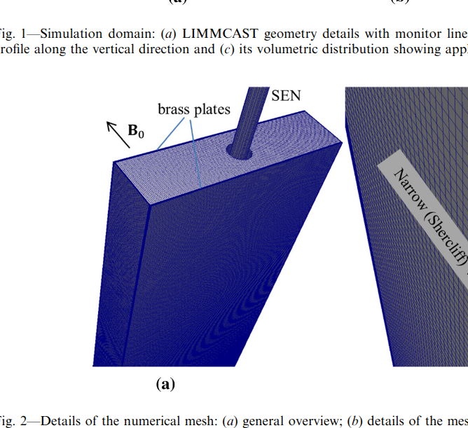

# RLSim: Custom OpenFOAM Solver

## To Do

#### **Part A: The Mold (Liquid Volume) `mold_walls.stl**`

This represents the shape of the liquid steel.

* **Shape:** Rectangular Box.
* 
**Thickness (Depth):** **35 mm** exactly ( mm half-thickness).

* **Width:** **100 mm** to **150 mm** (Estimated from LIMMCAST aspect ratios in Figure 1).
* **Height:** **600 mm** to **800 mm**.
* **Note:** This is the main container.

#### **Part B: The Nozzle (SEN) `SEN.stl**`

This is the pipe sticking into the top of the mold.

* **Type:** Bifurcated Nozzle (Inverted "T" shape inside, with two side ports).
* **Placement:** Sticking into the top center of the Mold.
* 
**Submergence:** The bottom of the nozzle should be about **100 mm** deep into the Mold.

* 
**Ports:** It needs two output ports pointing sideways towards the narrow walls of the mold (see Figure 1a and 4a in the paper).

* **Geometry:** The designer needs to model the *outer wall* of the nozzle as a closed solid.

#### **Part C: The Brass Plates (Solid Zone) `brass_plates.stl**`

These are the thin conductive plates attached to the wide walls of the mold.

* 
**Thickness:** **0.5 mm** exactly.

* **Location:** Attached to the *wide faces* of the Mold (the large front and back surfaces).
* **Dimensions:** They should cover the entire wide face of the liquid volume.
* **Assembly:** They must be perfectly flush with the liquid volume.
* *Fluid Interface:* The inner face of the plate touches the liquid.
* *Outer Air:* The outer face is exposed to the air.

---

### **3. Explainer Image for the Designer**

(Show them **Figure 1** and **Figure 2** from the paper so they understand the assembly).

* 
**Figure 1a:** Shows the Nozzle (SEN) shape.

* 
**Figure 2b:** Shows how the red "brass plate" layer sits on top of the mesh.

### **Summary of Files to Deliver:**

1. `mold_walls.stl` (The fluid box)
2. `SEN.stl` (The nozzle obstacle)
3. `brass_plates.stl` (The 0.5mm thick solid skins)